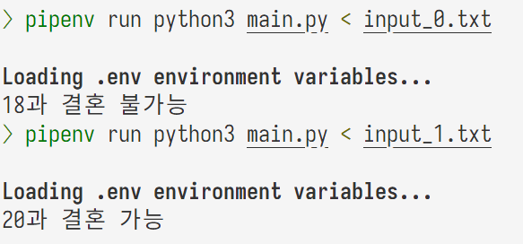

# Backtracking Algorithm the Best Problem Report

### 2019311801 이균서

## Execution Environment

### OS

```zsh
Distributor ID: Ubuntu
Description:    Ubuntu 22.04.3 LTS
Release:        22.04
Codename:       jammy
```

### `Python` Runtime

Python 3.11.6

### External Libraries

There is no external libraries used in the following source code.

`Pipfile`:

```
[[source]]
[[source]]
url = "https://pypi.org/simple"
verify_ssl = true
name = "pypi"

[packages]

[dev-packages]
cloudinary = "*"

[requires]
python_version = "3.11"
python_full_version = "3.11.6"
```

## Source Code

```python
import sys

input = sys.stdin.readline

graph = [[] for _ in range(100)]
ans = False

is_visited = [False for _ in range(100)]


def dfs(cur_node, kinship):
    if cur_node == target:
        global ans

        if kinship > 8:
            ans = True
            return
        ans = False
        return
    is_visited[cur_node] = True
    for next_node, weight in graph[cur_node]:
        if is_visited[next_node]:
            continue
        dfs(next_node, kinship + weight)


if __name__ == "__main__":
    me, target = map(int, input().rstrip().split())
    n = int(input().rstrip())
    for _ in range(n):
        a, relationship, b = input().rstrip().split()
        a = int(a)
        b = int(b)
        if relationship == "child":
            graph[a].append((b, 1))
            graph[b].append((a, 1))
        elif relationship == "marry":
            graph[a].append((b, 0))
            graph[b].append((a, 0))
    dfs(me, 0)
    if ans:
        print(f"{target}과 결혼 가능")
    else:
        print(f"{target}과 결혼 불가능")
```

## Execution Result

### How to run `main.py`:

```zsh
pipenv run python3 main.py < input_0.txt
pipenv run python3 main.py < input_1.txt
```

or

```zsh
python3 main.py < input_0.txt
python3 main.py < input_1.txt
```

- 실행이 안되면 <https://github.com/gyunseo/oakgorithms.git>을 `git clone` 하여, root directory에서 `pipenv install`을 하시고 `dynamic-programming/the-best-problem/`로 이동하셔서 `pipenv run python3 main.py < input.txt > output.txt`를 하시면 됩니다.

### Input

`input.txt`:

```
2085 11271518920813 12532021185 208919 1951351920518 23119 135114914762112 1144 91420518519209147. 20811411 251521 61518 191512229147 2085 1811441513 205113 161815212513.
```

### Output

`output.txt`:

```
8806025134080000
THE
AABGAEAHITHAC, AABGAEAHITHM, AABGAERITHAC, AABGAERITHM, AABGOAHITHAC, AABGOAHITHM, AABGORITHAC, AABGORITHM, ALGAEAHITHAC, ALGAEAHITHM, ALGAERITHAC, ALGAERITHM, ALGOAHITHAC, ALGOAHITHM, ALGORITHAC, ALGORITHM, KBGAEAHITHAC, KBGAEAHITHM, KBGAERITHAC, KBGAERITHM, KBGOAHITHAC, KBGOAHITHM, KBGORITHAC, KBGORITHM
ABECTBAAHE, ABECTBARE, ABECTBKHE, ABECTUAHE, ABECTURE, AYCTBAAHE, AYCTBARE, AYCTBKHE, AYCTUAHE, AYCTURE, LECTBAAHE, LECTBARE, LECTBKHE, LECTUAHE, LECTURE
THIAI, THIS
AIEACEAITEAH, AIEACEAITER, AIEACESTEAH, AIEACESTER, AIEMEAITEAH, AIEMEAITER, AIEMESTEAH, AIEMESTER, SEACEAITEAH, SEACEAITER, SEACESTEAH, SEACESTER, SEMEAITEAH, SEMEAITER, SEMESTEAH, SEMESTER
BCAAI, BCAS, BCKI, WAAI, WAS, WKI
ACEAADIADGFBAAB, ACEAADIADGFBAL, ACEAADIADGFBKB, ACEAADIADGFUAB, ACEAADIADGFUL, ACEAADINGFBAAB, ACEAADINGFBAL, ACEAADINGFBKB, ACEAADINGFUAB, ACEAADINGFUL, ACEANIADGFBAAB, ACEANIADGFBAL, ACEANIADGFBKB, ACEANIADGFUAB, ACEANIADGFUL, ACEANINGFBAAB, ACEANINGFBAL, ACEANINGFBKB, ACEANINGFUAB, ACEANINGFUL, ACEKDIADGFBAAB, ACEKDIADGFBAL, ACEKDIADGFBKB, ACEKDIADGFUAB, ACEKDIADGFUL, ACEKDINGFBAAB, ACEKDINGFBAL, ACEKDINGFBKB, ACEKDINGFUAB, ACEKDINGFUL, MEAADIADGFBAAB, MEAADIADGFBAL, MEAADIADGFBKB, MEAADIADGFUAB, MEAADIADGFUL, MEAADINGFBAAB, MEAADINGFBAL, MEAADINGFBKB, MEAADINGFUAB, MEAADINGFUL, MEANIADGFBAAB, MEANIADGFBAL, MEANIADGFBKB, MEANIADGFUAB, MEANIADGFUL, MEANINGFBAAB, MEANINGFBAL, MEANINGFBKB, MEANINGFUAB, MEANINGFUL, MEKDIADGFBAAB, MEKDIADGFBAL, MEKDIADGFBKB, MEKDIADGFUAB, MEKDIADGFUL, MEKDINGFBAAB, MEKDINGFBAL, MEKDINGFBKB, MEKDINGFUAB, MEKDINGFUL
AADD, AND, KDD
IADTEAHEAITIADG., IADTEAHEAITING., IADTEAHESTIADG., IADTEAHESTING., IADTEREAITIADG., IADTEREAITING., IADTERESTIADG., IADTERESTING., INTEAHEAITIADG., INTEAHEAITING., INTEAHESTIADG., INTEAHESTING., INTEREAITIADG., INTEREAITING., INTERESTIADG., INTERESTING.
THAADAA, THAADK, THANAA, THANK, THKDAA, THKDK
BEAEBA, BEAEU, BEOBA, BEOU, YAEBA, YAEU, YOBA, YOU
FAEAH, FAER, FOAH, FOR
AIAEABBBIADG, AIAEABBBING, AIAEABVIADG, AIAEABVING, AIAEAVBIADG, AIAEAVBING, AIAELBBIADG, AIAELBBING, AIAELVIADG, AIAELVING, AIOABBBIADG, AIOABBBING, AIOABVIADG, AIOABVING, AIOAVBIADG, AIOAVBING, AIOLBBIADG, AIOLBBING, AIOLVIADG, AIOLVING, SAEABBBIADG, SAEABBBING, SAEABVIADG, SAEABVING, SAEAVBIADG, SAEAVBING, SAELBBIADG, SAELBBING, SAELVIADG, SAELVING, SOABBBIADG, SOABBBING, SOABVIADG, SOABVING, SOAVBIADG, SOAVBING, SOLBBIADG, SOLBBING, SOLVIADG, SOLVING
THE
AHAADDAEAC, AHAADDAEM, AHAADDOAC, AHAADDOM, AHANDAEAC, AHANDAEM, AHANDOAC, AHANDOM, AHKDDAEAC, AHKDDAEM, AHKDDOAC, AHKDDOM, RAADDAEAC, RAADDAEM, RAADDOAC, RAADDOM, RANDAEAC, RANDAEM, RANDOAC, RANDOM, RKDDAEAC, RKDDAEM, RKDDOAC, RKDDOM
TEAAC, TEAM, TEKC
AFAHAEBABEAC., AFAHAEBABEM., AFAHAEBAYAC., AFAHAEBAYM., AFAHAEBLEAC., AFAHAEBLEM., AFAHAEUBEAC., AFAHAEUBEM., AFAHAEUYAC., AFAHAEUYM., AFAHOBABEAC., AFAHOBABEM., AFAHOBAYAC., AFAHOBAYM., AFAHOBLEAC., AFAHOBLEM., AFAHOUBEAC., AFAHOUBEM., AFAHOUYAC., AFAHOUYM., AFRAEBABEAC., AFRAEBABEM., AFRAEBAYAC., AFRAEBAYM., AFRAEBLEAC., AFRAEBLEM., AFRAEUBEAC., AFRAEUBEM., AFRAEUYAC., AFRAEUYM., AFROBABEAC., AFROBABEM., AFROBAYAC., AFROBAYM., AFROBLEAC., AFROBLEM., AFROUBEAC., AFROUBEM., AFROUYAC., AFROUYM., PAHAEBABEAC., PAHAEBABEM., PAHAEBAYAC., PAHAEBAYM., PAHAEBLEAC., PAHAEBLEM., PAHAEUBEAC., PAHAEUBEM., PAHAEUYAC., PAHAEUYM., PAHOBABEAC., PAHOBABEM., PAHOBAYAC., PAHOBAYM., PAHOBLEAC., PAHOBLEM., PAHOUBEAC., PAHOUBEM., PAHOUYAC., PAHOUYM., PRAEBABEAC., PRAEBABEM., PRAEBAYAC., PRAEBAYM., PRAEBLEAC., PRAEBLEM., PRAEUBEAC., PRAEUBEM., PRAEUYAC., PRAEUYM., PROBABEAC., PROBABEM., PROBAYAC., PROBAYM., PROBLEAC., PROBLEM., PROUBEAC., PROUBEM., PROUYAC., PROUYM.
```

## Execution Image



