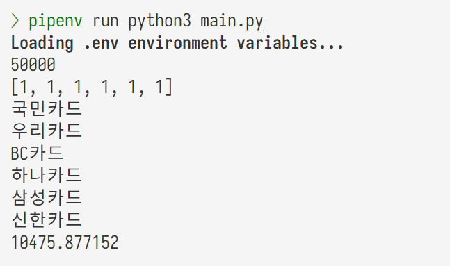

# Branch and Bound Algorithm the Best Problem Report

### 2019311801 이균서

## Execution Environment

### OS

```zsh
Distributor ID: Ubuntu
Description:    Ubuntu 22.04.3 LTS
Release:        22.04
Codename:       jammy
```

### `Python` Runtime

Python 3.11.6

### External Libraries

코드에 pandas 라이브러리를 이용했습니다. (다른 라이브러리는 개인적인 이유로 설치한 것입니다.)

`Pipfile`:

```
[[source]]
url = "https://pypi.org/simple"
verify_ssl = true
name = "pypi"

[packages]
anytree = "*"
binarytree = "*"
networkx = "*"
pandas = "*"

[dev-packages]
python-dotenv = "*"
cloudinary = "*"

[requires]
python_version = "3.11"
python_full_version = "3.11.6"
```

## Source Code

```python
# First, let's load and examine the contents of the uploaded CSV file to understand the data structure.
import pandas as pd

# Load the CSV file
file_path = "card.csv"
card_data = pd.read_csv(file_path)


# To implement the Branch and Bound algorithm, we first need to define the problem and necessary functions.


class Card:
    def __init__(self, name, min_spend, discount_percent, max_discount):
        self.name = name
        self.min_spend = min_spend
        self.discount_percent = discount_percent
        self.max_discount = max_discount

    def calculate_discount(self, spend):
        """Calculate the discount for a given spend."""
        if spend < self.min_spend:
            return 0
        return min(spend * self.discount_percent / 100, self.max_discount)


# Convert the CSV data to Card objects
card_objects = [
    Card(row["Unnamed: 0"], row["최소 결제 금액"], row["할인 퍼센트"], row["최대할인가능금액"])
    for _, row in card_data.iterrows()
]

card_objects.sort(key=lambda x: x.discount_percent, reverse=True)
# Test the function with a sample spend amount

# 분기한정 가지치기 최고우선탐색
import queue


class Node:
    def __init__(self, level, profit, bound, include):
        self.level = level
        # 할인이 들어간 금액이 profit
        self.profit = profit
        self.bound = bound
        self.include = include

    def __lt__(self, other):  # 마술함수
        return self.bound < other.bound


def Best_FS():
    global maxProfit
    global bestset
    temp = n * [0]
    v = Node(-1, 0, 0.0, temp)
    pq = queue.PriorityQueue()  # default가 min-heap
    v.bound = compute_bound(v)
    pq.put((-v.bound, v))  # min-heap이기 때문에 제일 작은 것을 먼저 빼온다. 그래서 bound 앞에 -를 붙인다.
    u = Node(0, 0, 0.0, temp)

    while not pq.empty():
        v = pq.get()[1]
        if v.bound > maxProfit:
            # Left child node - 따로 저장을 하면 pq에 잘 저장된다.
            level = v.level + 1
            profit = v.profit + card_objects[level].calculate_discount(W - v.profit)
            include = v.include[:]
            u = Node(level, profit, 0.0, include)
            u.include[level] = 1
            if u.profit > maxProfit:  # 배낭보다는 작아야한다 / Profit이 더 크다면
                maxProfit = u.profit  # maxProfit 갱신
                bestset = u.include  # 현재 include를 bestset에 저장
            u.bound = compute_bound(u)
            if u.bound > maxProfit:
                pq.put((-u.bound, u))

            # Right child node
            u = Node(level, v.profit, 0.0, v.include)
            u.bound = compute_bound(u)
            if u.bound > maxProfit:
                pq.put((-u.bound, u))


def compute_bound(u):
    money_to_be_discounted = W - u.profit
    tmp_bound = u.profit
    for i, card in enumerate(card_objects):
        # 아직 이 카드를 사용하지 않았고, 최소 결제 금액을 만족한다면
        if u.include[i] == 0 and money_to_be_discounted >= card.min_spend:
            money_to_be_discounted -= card.calculate_discount(money_to_be_discounted)
            tmp_bound += card.calculate_discount(money_to_be_discounted)
    return tmp_bound


# heap이 minheap이라 bound를 계산하여 -를 하여 리턴한다. 비교를 < maxProfit으로 수행한다.
n = 6  # 국민, 우리, BC, 하나, 삼성, 신한 일단은 할인 퍼센트가 높은 순서대로 정렬
W = int(input())
include = [0] * n
maxProfit = 0
bestset = n * [0]
Best_FS()
print(
    bestset
)  # 국민, 우리, BC, 하나, 삼성, 신한 순서대로 이다. 예) [1, 1, 1, 1, 0, 0] 이면 국민, 우리, BC, 하나 카드를 사용한다.
# 카드 이름도 출력한다.
for i, card in enumerate(card_objects):
    if bestset[i] == 1:
        print(card.name)
print(maxProfit)  # 할인 받을 수 있는 최대 금액
```

## Execution Result

### How to run `main.py`:

```zsh
pipenv install pandas
pipenv run python3 main.py
```

```zsh
pip install pandas
python3 main.py
```

- 실행이 안되면 <https://github.com/gyunseo/oakgorithms.git>을 `git clone` 하여, root directory에서 `pipenv install`을 하시고 `branch-and-bound/the-best-problem/`로 이동하셔서 `pipenv run python3 main.py`를 하시면 됩니다.

### Input

```
50000
```

### Output

리스트에 해당하는 카드는 순서대로 국민, 우리, BC, 하나, 삼성, 신한입니다.

```
[1, 1, 1, 1, 1, 1]
국민카드
우리카드
BC카드
하나카드
삼성카드
신한카드
10475.877152
```

## Execution Image


