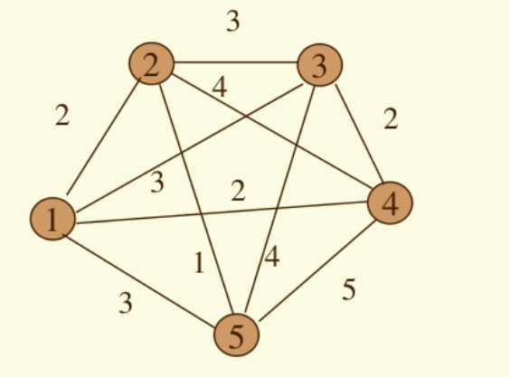

# Brute Force - Traveling Salesman Problem

## 문제 설명

- 자신의 원하는 프로그래밍 언어를 사용하여 Traveling Salesman Problem을 구현해보세요.
- 입력 자료는 아래의 그래프를 사용 하시고,
- starting vertex는 1로 적용하시기 바랍니다.
- running time report module을 포함 시키어, TSP를 Brute Force로 처리하는데 걸리는 실행시간도 같이 출력해주시기 바랍니다.
- 가급적 본인의 로컬 환경에서 실행시키시기 바랍니다.
- 코드와 함께 실행 결과 화면도 같이 posting해주시기 바랍니다.
- 유익한 평소학습 되시기 바랍니다!

## Input



```python
graph = [
    [],  # 정점 0은 사용하지 않으며, 1부터 시작한다.
    [(2, 1), (3, 3), (4,2), (5,3)],  # 정점 1에서 다른 정점으로 가는 가중치
    [(1, 2), (3, 3), (4, 4), (5, 1)],  # 정점 2에서 다른 정점으로 가는 가중치
    [(1, 3), (2, 3), (4, 2), (5, 4)],  # 정점 3에서 다른 정점으로 가는 가중치
    [(1, 2), (2, 4), (3, 2), (5, 5)],  # 정점 4에서 다른 정점으로 가는 가중치
    [(1, 3), (2, 1), (3, 4), (4, 5)]   # 정점 5에서 다른 정점으로 가는 가중치
]
```
