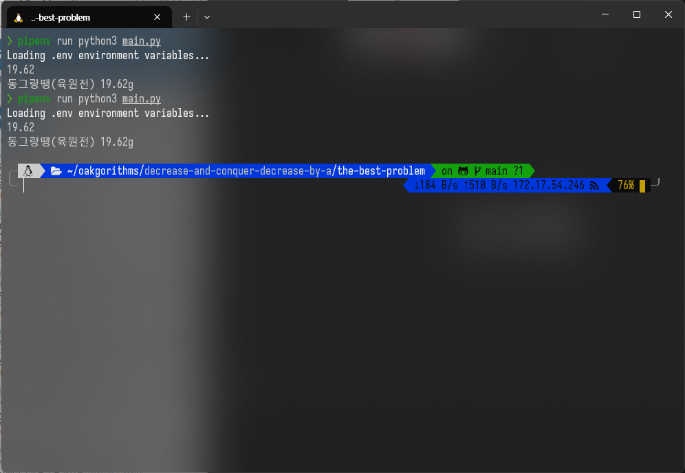

# Decrease and Conquer: Decrease by a Constant Factor and Variable Size Decrease the Best Problem Report

### 2019311801 이균서

## Execution Environment

### OS

```zsh
Distributor ID: Ubuntu
Description:    Ubuntu 22.04.3 LTS
Release:        22.04
Codename:       jammy
```

### `Python` Runtime

Python 3.11.6

### external libraries

There is no external libraries used in the following source code.

`Pipfile`:

```
[[source]]
[[source]]
url = "https://pypi.org/simple"
verify_ssl = true
name = "pypi"

[packages]

[dev-packages]
cloudinary = "*"

[requires]
python_version = "3.11"
python_full_version = "3.11.6"
```

\newpage

## Source Code

```python
import sys

# method aliasing
input = sys.stdin.readline
print = sys.stdout.write


# csv 파일 읽기
data = []
with open("foods.csv", "r") as file:
    for line in file:
        food, protein = line.strip().split(",")
        if food == "food":  # 헤더 라인은 건너뛰기
            continue
        data.append((food, float(protein)))

sorted_data = sorted(data, key=lambda x: x[1])
# print(f"{sorted_data}\n")
protein_target = float(input())

# interpolation search to find the  index of element that is equal to the protein_target

low = 0
high = len(sorted_data) - 1

while low <= high:
    if sorted_data[low][1] == sorted_data[high][1]:
        break

    # 이분 탐색과 구분되는 보간 탐색의 핵심 로직
    mid = low + int(
        (high - low)
        * (protein_target - sorted_data[low][1])
        / (sorted_data[high][1] - sorted_data[low][1])
    )

    if sorted_data[mid][1] == protein_target:
        low = mid
        break
    elif sorted_data[mid][1] < protein_target:
        low = mid + 1
    else:
        high = mid - 1

# output 포맷에 맞게 설정
print(f"{sorted_data[low][0]} {sorted_data[low][1]}g\n")

```

\newpage

## Execution Result

### how to run:

```zsh
pipenv run python3 main.py
```

### input:

```zsh
19.62
```

### result:

```zsh
동그랑땡(육원전) 19.62g
```

## Execution Image


