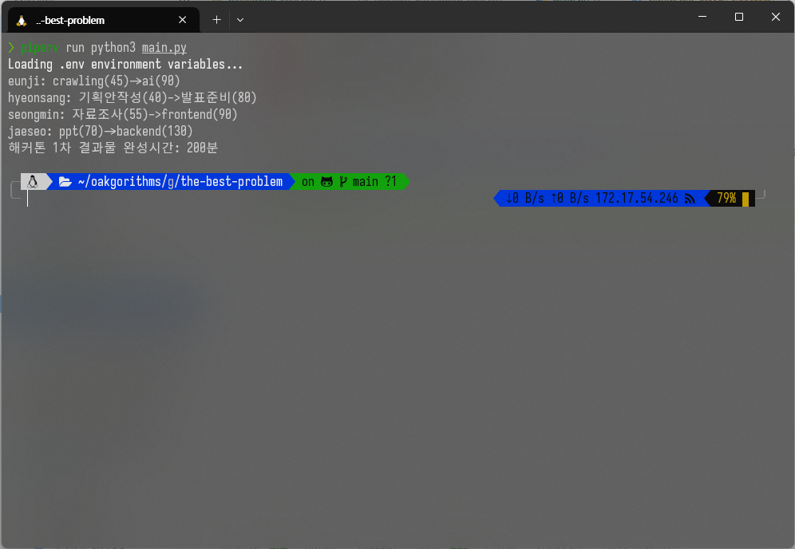

# Transform and Conquer the Best Problem Report

### 2019311801 이균서

## Execution Environment

### OS

```zsh
Distributor ID: Ubuntu
Description:    Ubuntu 22.04.3 LTS
Release:        22.04
Codename:       jammy
```

### `Python` Runtime

Python 3.11.6

### external libraries

There is no external libraries used in the following source code.

`Pipfile`:

```
[[source]]
[[source]]
url = "https://pypi.org/simple"
verify_ssl = true
name = "pypi"

[packages]

[dev-packages]
cloudinary = "*"

[requires]
python_version = "3.11"
python_full_version = "3.11.6"
```

\newpage

## Source Code

## Execution Result

```zsh
pipenv --python 3.11
pipenv run main.py
```

or

```zsh
python3 main.py
```

### input:

같은 directory에 있는 `hackathon_task.csv`

### result:

```zsh
eunji: crawling(45)->ai(90)
hyeonsang: 기획안작성(40)->발표준비(80)
seongmin: 자료조사(55)->frontend(90)
jaeseo: ppt(70)->backend(130)
해커톤 1차 결과물 완성시간: 200분
```

- 실행이 안되면 <https://github.com/gyunseo/oakgorithms.git>을 `git clone` 하여, root directory에서 `pipenv install`을 하시고 `greedy-algorithm/the-best-problem/`로 이동하셔서 `pipenv run python3 main.py`를 하시면 됩니다.

## Execution Image


