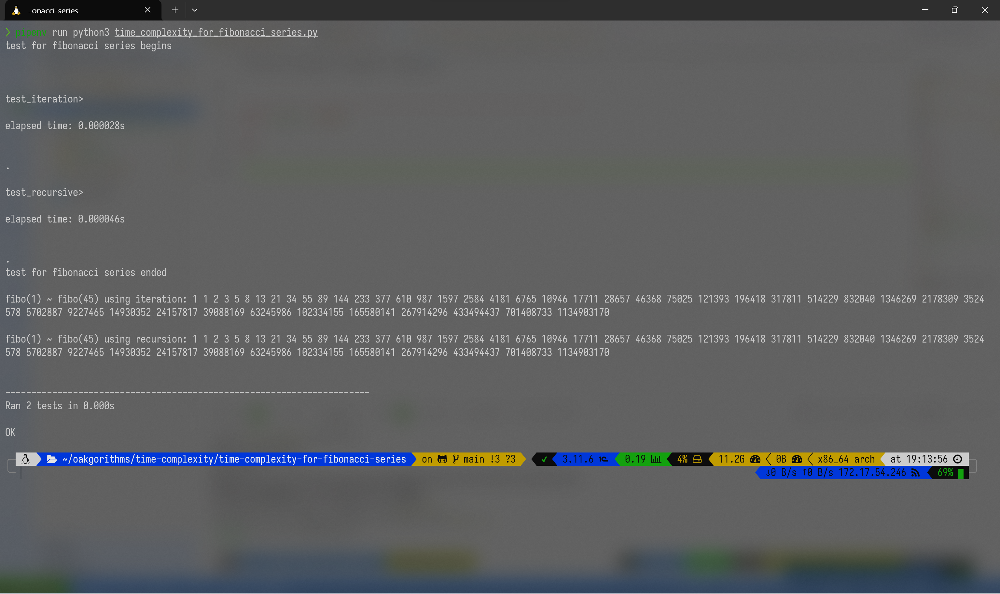

<!--
 Copyright 2023 gyunseo

 Licensed under the Apache License, Version 2.0 (the "License");
 you may not use this file except in compliance with the License.
 You may obtain a copy of the License at

     http://www.apache.org/licenses/LICENSE-2.0

 Unless required by applicable law or agreed to in writing, software
 distributed under the License is distributed on an "AS IS" BASIS,
 WITHOUT WARRANTIES OR CONDITIONS OF ANY KIND, either express or implied.
 See the License for the specific language governing permissions and
 limitations under the License.
-->

# Time Complexity for Fibonacci Series Report

### 2019311801 이균서

## Execution Environment

### OS

```zsh
Distributor ID: Ubuntu
Description:    Ubuntu 22.04.3 LTS
Release:        22.04
Codename:       jammy
```

### `Python` Runtime

Python 3.11.6

### external libraries

There is no external libraries used in the following source code.

`Pipfile`:

```
[[source]]
[[source]]
url = "https://pypi.org/simple"
verify_ssl = true
name = "pypi"

[packages]

[dev-packages]
cloudinary = "*"

[requires]
python_version = "3.11"
python_full_version = "3.11.6"
```

## Source Code

```python
import sys, unittest, time

sys.setrecursionlimit(10**9)


def get_fibonacci_series_by_recursive(n):
    dp = [None for _ in range(n + 1)]
    dp[0] = 0
    dp[1] = 1

    def recursive(num):
        if dp[num] != None:
            return dp[num]

        dp[num] = recursive(num - 1) + recursive(num - 2)
        return dp[num]

    recursive(n)

    return " ".join(map(str, dp[1 : n + 1]))


def get_fibonacci_series_by_iteration(n):
    # i = 3
    # a = fibo(i - 1), b = fibo(i - 2)
    a, b = 1, 1
    fibo_series = [a, b]
    for i in range(4, n + 2):
        a, b = a + b, a
        fibo_series.append(a)

    return " ".join(map(str, fibo_series))


class FibonacciSeriesTest(unittest.TestCase):
    maxDiff = None

    @classmethod
    def setUpClass(cls) -> None:
        print("test for fibonacci series begins\n")

    @classmethod
    def tearDownClass(cls) -> None:
        print("\ntest for fibonacci series ended\n")
        print(
            f"fibo(1) ~ fibo(45) using iteration: {get_fibonacci_series_by_iteration(45)}\n"
        )
        print(
            f"fibo(1) ~ fibo(45) using recursion: {get_fibonacci_series_by_recursive(45)}\n"
        )

    def setUp(self):
        self.begin_time = time.time()

    def tearDown(self):
        self.end_time = time.time()
        print(f"\nelapsed time: {self.end_time - self.begin_time:4f}s\n\n")

    def test_recursive(self):
        print(f"\n\n{sys._getframe(0).f_code.co_name}>")
        self.assertEqual(
            get_fibonacci_series_by_recursive(45),
            "1 1 2 3 5 8 13 21 34 55 89 144 233 377 610 987 1597 2584 4181 6765 10946 17711 28657 46368 75025 121393 196418 317811 514229 832040 1346269 2178309 3524578 5702887 9227465 14930352 24157817 39088169 63245986 102334155 165580141 267914296 433494437 701408733 1134903170",
        )

    def test_iteration(self):
        print(f"\n\n{sys._getframe(0).f_code.co_name}>")
        self.assertEqual(
            get_fibonacci_series_by_iteration(45),
            "1 1 2 3 5 8 13 21 34 55 89 144 233 377 610 987 1597 2584 4181 6765 10946 17711 28657 46368 75025 121393 196418 317811 514229 832040 1346269 2178309 3524578 5702887 9227465 14930352 24157817 39088169 63245986 102334155 165580141 267914296 433494437 701408733 1134903170",
        )


if __name__ == "__main__":
    unittest.main()

```

## Execution Result

```zsh
pipenv run python3 time_complexity_for_fibonacci_series.py
```

```zsh
test for fibonacci series begins


test_iteration>

elapsed time: 0.000048s


.

test_recursive>

elapsed time: 0.000043s


.
test for fibonacci series ended

fibo(1) ~ fibo(45) using iteration: 1 1 2 3 5 8 13 21 34 55 89 144 233 377 610 987 1597 2584 4181 6765 10946 17711 28657 46368 75025 121393 196418 317811 514229 832040 1346269 2178309 3524578 5702887 9227465 14930352 24157817 39088169 63245986 102334155 165580141 267914296 433494437 701408733 1134903170

fibo(1) ~ fibo(45) using recursion: 1 1 2 3 5 8 13 21 34 55 89 144 233 377 610 987 1597 2584 4181 6765 10946 17711 28657 46368 75025 121393 196418 317811 514229 832040 1346269 2178309 3524578 5702887 9227465 14930352 24157817 39088169 63245986 102334155 165580141 267914296 433494437 701408733 1134903170


----------------------------------------------------------------------
Ran 2 tests in 0.000s

OK
```

### Execution Image


