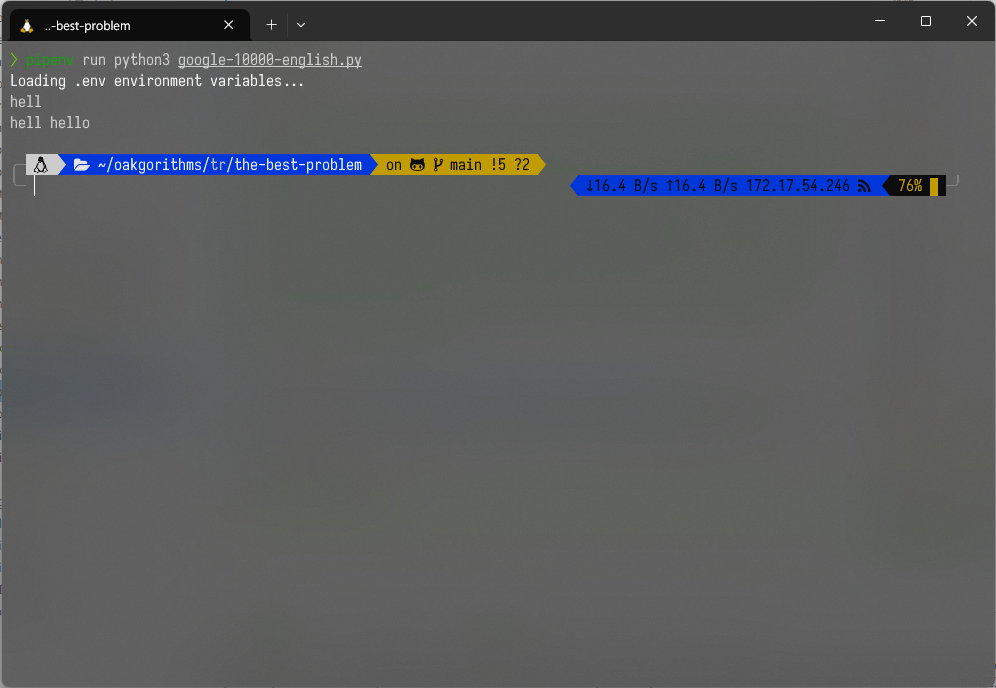
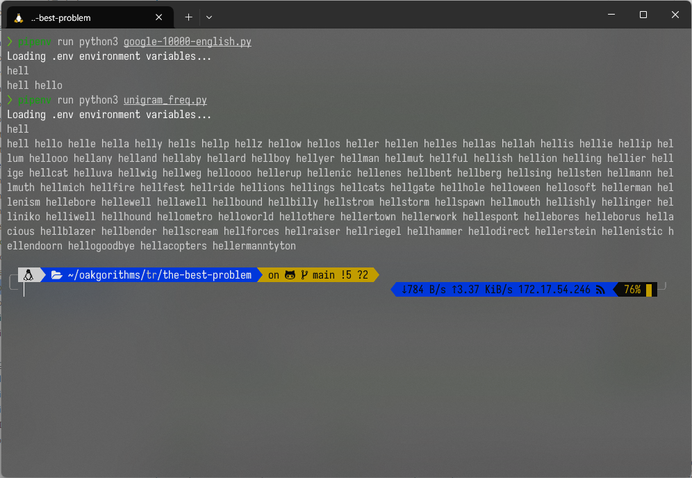

# Transform and Conquer the Best Problem Report

### 2019311801 이균서

## Execution Environment

### OS

```zsh
Distributor ID: Ubuntu
Description:    Ubuntu 22.04.3 LTS
Release:        22.04
Codename:       jammy
```

### `Python` Runtime

Python 3.11.6

### external libraries

There is no external libraries used in the following source code.

`Pipfile`:

```
[[source]]
[[source]]
url = "https://pypi.org/simple"
verify_ssl = true
name = "pypi"

[packages]

[dev-packages]
cloudinary = "*"

[requires]
python_version = "3.11"
python_full_version = "3.11.6"
```

\newpage

## Source Code

### `google-10000-english.py`:

```python
# Copyright 2023 gyunseo
#
# Licensed under the Apache License, Version 2.0 (the "License");
# you may not use this file except in compliance with the License.
# You may obtain a copy of the License at
#
#     http://www.apache.org/licenses/LICENSE-2.0
#
# Unless required by applicable law or agreed to in writing, software
# distributed under the License is distributed on an "AS IS" BASIS,
# WITHOUT WARRANTIES OR CONDITIONS OF ANY KIND, either express or implied.
# See the License for the specific language governing permissions and
# limitations under the License.

# trie code 참고 https://m.blog.naver.com/cjsencks/221740232900


class Node:
    def __init__(self, key, data=None):
        # key는 문자 하나 (root 노드는 None)
        self.key = key
        # data는 문자열의 끝을 알리는 flag (root 노드는 None)
        self.data = data
        # children은 자식 노드들을 저장하는 dictionary
        self.children = {}


class Trie:
    def __init__(self):
        # head는 더미 노드
        self.head = Node(None)

    def insert_node_with_str(self, str_arg):
        # 현재 노드를 더미 노드로 set up
        cur_node = self.head

        # str_arg의 각 문자에 대해
        # 해당 문자를 key로 하는 자식 노드가 없으면
        # 해당 문자를 key로 하는 자식 노드를 만듦
        for ch in str_arg:
            if ch in cur_node.children:
                # cur_node를 해당 문자를 key로 하는 자식 노드로 update
                cur_node = cur_node.children[ch]
                continue

            # 해당 문자를 key로 하는 자식 노드가 없으면
            # cur_node를 해당 문자를 key로 하는 자식 노드로 update
            cur_node.children[ch] = Node(ch)
            # cur_node를 해당 문자를 key로 하는 자식 노드로 update
            cur_node = cur_node.children[ch]
        # leaf 노드에 해당 문자열을 data로 저장
        cur_node.data = str_arg

    def check_word_exist(self, str_arg):
        # 현재 노드를 더미 노드로 set up
        cur_node = self.head

        for ch in str_arg:
            # 해당 문자를 key로 하는 자식 노드가 있으면
            # cur_node를 해당 문자를 key로 하는 자식 노드로 update
            # 있으면 계속 타고 내려가는 것
            if ch in cur_node.children:
                cur_node = cur_node.children[ch]
                continue
            # 하나라도 없으면 바로 False return
            return False
        # 문자열의 끝을 알리는 flag가 있으면 True return
        if cur_node.data:
            return True
        # 문자열의 끝을 알리는 flag가 없으면 False return
        return False

    def get_word_with_prefix(self, prefix_str):
        # 현재 노드를 더미 노드로 set up
        cur_node = self.head
        # return할 문자열들을 저장할 list
        ret_words = []

        for ch in prefix_str:
            # 해당 문자를 key로 하는 자식 노드가 있으면
            # 계속 타고 내려가는 것
            if ch in cur_node.children:
                cur_node = cur_node.children[ch]
                continue
            # 하나라도 없으면 바로 return
            return ret_words

        cur_node = [cur_node]
        next_node = []
        iteration_trigger = True
        while iteration_trigger:
            for node in cur_node:
                if node.data:
                    ret_words.append(node.data)
                # 자식 노드들을 next_node에 저장
                next_node += [*node.children.values()]
                # next_node.extend(list(node.children.values()))
            if len(next_node) == 0:
                iteration_trigger = False
                continue
            cur_node = next_node
            next_node = []

        return ret_words


import sys

trie = Trie()
input = sys.stdin.readline
print = sys.stdout.write

target_word = input().rstrip()
word_list = []
with open("google-10000-english.txt", "r") as f:
    for line in f.readlines():
        word_list.append(line.rstrip())
for word in word_list:
    trie.insert_node_with_str(word)

if not trie.check_word_exist(target_word):
    print("NONE\n")
else:
    print(" ".join(trie.get_word_with_prefix(target_word)))
    print("\n")


```

\newpage

### `unigram_freq.py`:

```python
# Copyright 2023 gyunseo
#
# Licensed under the Apache License, Version 2.0 (the "License");
# you may not use this file except in compliance with the License.
# You may obtain a copy of the License at
#
#     http://www.apache.org/licenses/LICENSE-2.0
#
# Unless required by applicable law or agreed to in writing, software
# distributed under the License is distributed on an "AS IS" BASIS,
# WITHOUT WARRANTIES OR CONDITIONS OF ANY KIND, either express or implied.
# See the License for the specific language governing permissions and
# limitations under the License.

# trie code 참고 https://m.blog.naver.com/cjsencks/221740232900


class Node:
    def __init__(self, key, data=None):
        # key는 문자 하나 (root 노드는 None)
        self.key = key
        # data는 문자열의 끝을 알리는 flag (root 노드는 None)
        self.data = data
        # children은 자식 노드들을 저장하는 dictionary
        self.children = {}


class Trie:
    def __init__(self):
        # head는 더미 노드
        self.head = Node(None)

    def insert_node_with_str(self, str_arg):
        # 현재 노드를 더미 노드로 set up
        cur_node = self.head

        # str_arg의 각 문자에 대해
        # 해당 문자를 key로 하는 자식 노드가 없으면
        # 해당 문자를 key로 하는 자식 노드를 만듦
        for ch in str_arg:
            if ch in cur_node.children:
                # cur_node를 해당 문자를 key로 하는 자식 노드로 update
                cur_node = cur_node.children[ch]
                continue

            # 해당 문자를 key로 하는 자식 노드가 없으면
            # cur_node를 해당 문자를 key로 하는 자식 노드로 update
            cur_node.children[ch] = Node(ch)
            # cur_node를 해당 문자를 key로 하는 자식 노드로 update
            cur_node = cur_node.children[ch]
        # leaf 노드에 해당 문자열을 data로 저장
        cur_node.data = str_arg

    def check_word_exist(self, str_arg):
        # 현재 노드를 더미 노드로 set up
        cur_node = self.head

        for ch in str_arg:
            # 해당 문자를 key로 하는 자식 노드가 있으면
            # cur_node를 해당 문자를 key로 하는 자식 노드로 update
            # 있으면 계속 타고 내려가는 것
            if ch in cur_node.children:
                cur_node = cur_node.children[ch]
                continue
            # 하나라도 없으면 바로 False return
            return False
        # 문자열의 끝을 알리는 flag가 있으면 True return
        if cur_node.data:
            return True
        # 문자열의 끝을 알리는 flag가 없으면 False return
        return False

    def get_word_with_prefix(self, prefix_str):
        # 현재 노드를 더미 노드로 set up
        cur_node = self.head
        # return할 문자열들을 저장할 list
        ret_words = []

        for ch in prefix_str:
            # 해당 문자를 key로 하는 자식 노드가 있으면
            # 계속 타고 내려가는 것
            if ch in cur_node.children:
                cur_node = cur_node.children[ch]
                continue
            # 하나라도 없으면 바로 return
            return ret_words

        cur_node = [cur_node]
        next_node = []
        iteration_trigger = True
        while iteration_trigger:
            for node in cur_node:
                if node.data:
                    ret_words.append(node.data)
                # 자식 노드들을 next_node에 저장
                next_node += [*node.children.values()]
                # next_node.extend(list(node.children.values()))
            if len(next_node) == 0:
                iteration_trigger = False
                continue
            cur_node = next_node
            next_node = []

        return ret_words


import sys

trie = Trie()
input = sys.stdin.readline
print = sys.stdout.write

target_word = input().rstrip()
word_list = []
with open("unigram_freq.txt", "r") as f:
    for line in f.readlines():
        word_list.append(line.rstrip())
for word in word_list:
    trie.insert_node_with_str(word)

if not trie.check_word_exist(target_word):
    print("NONE\n")
else:
    print(" ".join(trie.get_word_with_prefix(target_word)))
    print("\n")

```

## Execution Result

### how to run `google-10000-english.py`:

```zsh
pipenv --python 3.11
pipenv run google-10000-english.py
```

or

```zsh
python3 google-10000-english.py
```

### input:

```zsh
hell
```

### result:

```zsh
hell hello
```

- 실행이 안되면 <https://github.com/gyunseo/oakgorithms.git>을 `git clone` 하여, root directory에서 `pipenv install`을 하시고 `transfrom-and-conquer/the-best-problem/`로 이동하셔서 `pipenv run python3 google-10000-english.py`를 하시면 됩니다.

### how to run `unigram_freq.py`:

```zsh
pipenv --python 3.11
pipenv run unigram_freq.py
```

or

```zsh
python3 unigram_freq.py
```

### input:

```zsh
hell
```

### result:

```zsh
hell hello helle hella helly hells hellp hellz hellow hellos heller hellen helles hellas hellah hellis hellie hellip hellum hellooo hellany helland hellaby hellard hellboy hellyer hellman hellmut hellful hellish hellion helling hellier hellige hellcat helluva hellwig hellweg helloooo hellerup hellenic hellenes hellbent hellberg hellsing hellsten hellmann hellmuth hellmich hellfire hellfest hellride hellions hellings hellcats hellgate hellhole helloween hellosoft hellerman hellenism hellebore hellewell hellawell hellbound hellbilly hellstrom hellstorm hellspawn hellmouth hellishly hellinger helliniko helliwell hellhound hellometro helloworld hellothere hellertown hellerwork hellespont hellebores helleborus hellacious hellblazer hellbender hellscream hellforces hellraiser hellriegel hellhammer hellodirect hellerstein hellenistic hellendoorn hellogoodbye hellacopters hellermanntyton
```

- 실행이 안되면 <https://github.com/gyunseo/oakgorithms.git>을 `git clone` 하여, root directory에서 `pipenv install`을 하시고 `transfrom-and-conquer/the-best-problem/`로 이동하셔서 `pipenv run python3 unigram_freq.py`를 하시면 됩니다.

## Execution Image



